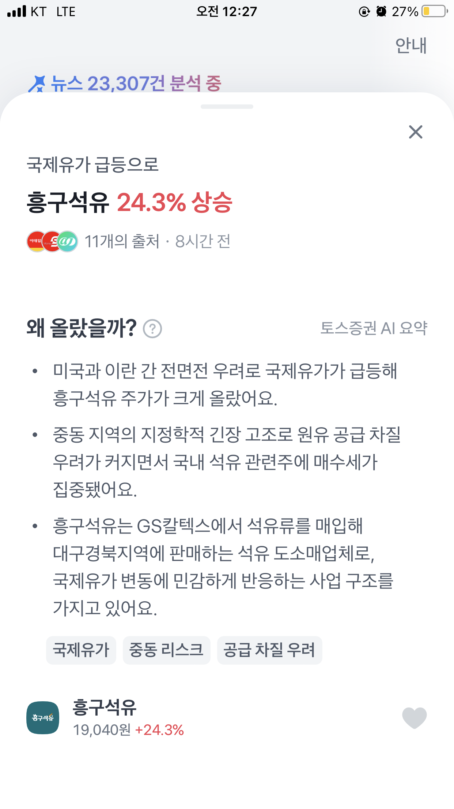

평소 즐겨보던 **토스 증권의 시그널** 기능을 내 식대로 재해석해보는 **클론 코딩** 프로젝트를 시작합니다. 복잡한 인프라나 비용 고민 없이, **GitHub Actions**와 **Gemini 1.5 Flash** 모델을 활용해 서버리스로 돌아가는 **AI 주식 자동화 아카이브**를 만드는 0일차 기록입니다. 수많은 뉴스 프로젝트 속에서 특정 종목이 급등하거나 급락한 원인을 한 줄로 명쾌하게 요약해주는 점이 매우 효율적이었으나, 데이터가 휘발된다는 아쉬움을 해결하기 위해 직접 **소프트웨어 설계**부터 기획까지 착수하게 되었습니다.

"코딩은 기세다"

### 프로젝트의 시작: 토스 시그널의 재해석




위 이미지와 같이 간결하면서도 핵심 정보를 담은 데이터를 매일 자동으로 수집하는 시스템을 만드는 것이 목표입니다. 개발 단계에서 가장 중점을 둔 원칙은 두 가지입니다. 첫째는 '완전 자동화'입니다. 매일 수동으로 실행하지 않아도 데이터가 축적되어야 합니다. 둘째는 '비용 제로'입니다. 서버 임대료나 데이터베이스 비용 없이 운영할 수 있는 구조를 설계하고자 했습니다.

### 기술 스택 선정: GitHub Actions와 Gemini API

이를 위해 GitHub Actions와 Gemini API를 결합한 파이프라인을 구상했습니다. GitHub Actions는 서버 없이도 정해진 시간마다 스크립트를 실행할 수 있는 환경을 제공하며, Gemini API는 뉴스 본문을 요약하는 데 필요한 뛰어난 자연어 처리 능력을 갖추고 있습니다. 특히 Gemini 모델은 구글 생태계의 장점을 살려 한국어 이해도가 높고 속도가 빠르며, 무료 티어의 할당량이 충분하여 개인 프로젝트에 매우 적합하다는 판단을 내렸습니다.

### 데이터 구조 설계: 이슈 중심의 아카이브

데이터 설계 과정에서는 종목 개별 정보보다 '이슈(Signal)'에 집중하는 구조를 택했습니다. 단순히 특정 주가가 올랐다는 사실보다, 어떤 거시적 이슈나 기업 내부의 이벤트가 관련 종목들을 동반 상승시켰는지 그 맥락을 파악하는 것이 중요하기 때문입니다. 

초기 설계 단계에서 Google AI Studio를 활용하여 프롬프트를 수차례 테스트했습니다. 뉴스 본문의 유효한 정보를 추출하는 프롬프트와 이를 JSON 구조로 정형화하는 과정을 거쳤습니다. 이 과정에서 확정한 데이터 필드는 시그널 ID, 테마명, 요약 내용, 주력 종목 및 연관 종목 리스트입니다.

구체적인 JSON 스키마는 다음과 같습니다.

```json
{
  "signals": [
    {
      "id": "sig_20260220_KR_001",
      "theme": "#AI반도체",
      "summary": "엔비디아 호실적 발표로 HBM 관련주 동반 강세",
      "main_stock": {
        "name": "SK하이닉스",
        "symbol": "000660",
        "change_rate": "+5.2%"
      },
      "related_stocks": [
        {"name": "한미반도체", "change_rate": "+12.1%"},
        {"name": "이수페타시스", "change_rate": "+8.4%"}
      ]
    }
  ]
}
```

이제 설계도가 완성되었습니다. 내일부터는 본격적으로 파이썬을 이용한 데이터 수집 크롤러 개발에 착수할 예정입니다. 서버 비용 없이 24시간 작동하는 자동화 파이프라인이 어떤 모습으로 구현될지 기대가 됩니다.

---
### 오늘의 개발 요약

목표: 주식 시그널 데이터 아카이브 구축을 위한 기획 및 기술 스택 확정
도구: Python, Gemini 1.5 Flash, GitHub Actions

*태그: 프로젝트시작, GeminiAI, 기획, 소프트웨어설계, GitHubActions, 주식자동화, 개발일기*


---
️ **다음 글:** [[바이브 코딩 #1] AI 주식 시그널 아카이브: 이 종목 왜 올랐지? 자동 수집 파이프라인 구축하기](./2026-02-20.md)