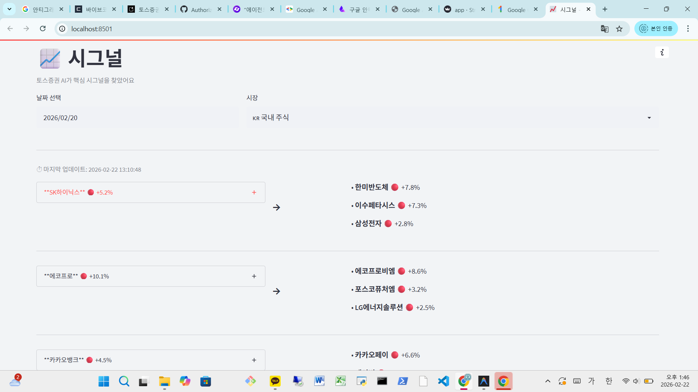

백엔드에서 고해상도의 AI 시그널 데이터가 생성되기 시작하면서, 이를 사용자에게 보여줄 최소한의 인터페이스가 필요해졌습니다. 3일차인 오늘은 파이썬만으로 빠르게 **데이터 시각화** 웹 앱을 만들 수 있는 **Streamlit**을 도입하고, **Streamlit Cloud**를 통해 단축된 배포 과정을 거쳐 실시간 서비스를 세상에 공개했습니다.

아직 디자인 시스템이나 복잡한 레이아웃을 고민할 단계는 아니었습니다. 하지만 Gemini AI가 분석한 날카로운 시그널들이 콘솔창이 아닌 웹 브라우저에서 읽힐 때 그 가치가 실감 날 것이라고 판단했습니다. 파이썬 기반의 웹 프레임워크인 **Streamlit**을 사용하여 단 몇 줄의 코드만으로 수집된 데이터(JSON)를 화면에 렌더링했습니다.

보여줄 화면은 투박했지만, 텍스트 데이터의 해상도가 높아지는 것을 보며 보람을 느꼈습니다. 종목명과 등락 원인, 그리고 AI가 매긴 임팩트 점수가 브라우저에 표시되는 순간, 단순한 스크립트가 하나의 '서비스'로 느껴지기 시작했습니다.

### 2. Streamlit Cloud를 통한 초고속 배포

로컬에서만 확인하던 화면을 외부에서도 접속할 수 있게 만드는 작업은 생각보다 간단했습니다. **Streamlit Cloud** 서비스를 활용하여 GitHub 저장소와 연동하니, 푸시 한 번에 자동으로 서비스가 배포되었습니다. 

*   **GitHub 연동:** `.streamlit/secrets.toml`에 관리하던 API 키를 Streamlit Cloud의 Secrets 설정에 등록하여 보안을 유지했습니다.
*   **실시간 확인:** 이제 스마트폰으로도 내가 만든 AI 주식 시그널을 언제든 확인할 수 있게 되었습니다.

비록 화려한 장식은 없지만, 주식 시장의 테마와 개별 종목의 특이사항을 입체적으로 기록할 수 있는 체계가 드디어 세상 밖으로 나왔습니다. 내일부터는 더 방대한 데이터 처리를 위해 글로벌 시장의 선두인 미국 주식 데이터를 통합하는 과정을 다룰 예정입니다.

---
### 오늘의 개발 요약

*   **목표:** Streamlit을 활용한 데이터 시각화 및 클라우드 배포 환경 구축
*   **도구:** Streamlit, Streamlit Cloud, GitHub
*   **성과:** 누구나 접속 가능한 초기 웹 서비스 형태 완성

*태그: Streamlit, StreamlitCloud, 웹서비스, 데이터시각화, 파이썬개발, 개발일기*

---
 **이전 글:** [[바이브 코딩 #2] AI 주식 시그널 아카이브: Gemini 프롬프트 엔지니어링 - 주가 변동 원인 분석](./2026-02-21.md)

️ **다음 글:** [[바이브 코딩 #4] AI 주식 시그널 아카이브: 미국 주식 데이터 연동과 관련 데이터 조회 화면](./2026-02-23.md)