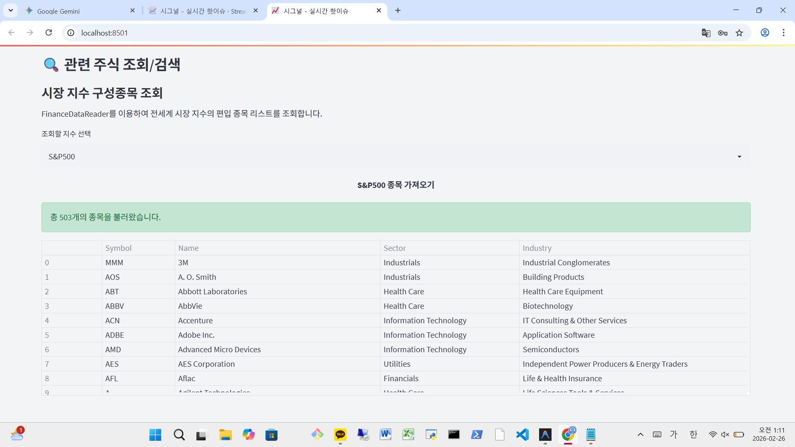

국내 시장을 넘어 글로벌 시그널을 확보하기 위해 **미국 주식** 데이터를 통합한 4일차 기록입니다. **yfinance** 라이브러리를 통해 **나스닥** 및 뉴욕증시의 애널리스트 데이터를 수집하고, **pytz** 기반의 시차 보정을 거쳐 완벽한 글로벌 파이프라인을 구축했습니다. 또한, 종목 간의 연결 고리를 스스로 찾아내는 **연관 종목 매칭 엔진**과 직관적인 검색 UI의 초기 버전을 선보였습니다.
### 1. yfinance를 활용한 미국 데이터 확보
미국 주식 데이터 소스로 `yfinance`를 채택했다. 유료 API 대비 비용 효율이 높고, 주가 외에 애널리스트의 등급 조정(Upgrades/Downgrades)이나 목표 주가 같은 비정형 데이터를 가져오기 용이하기 때문이다. 수집된 전문 분석 데이터를 Gemini 프롬프트에 입력하여 요약문의 품질을 개선했다.

### 2. pytz 기반의 시차 및 실행 로직 최적화
미국 시장과 한국 표준시(KST) 사이의 시차 문제를 해결하기 위해 `pytz` 라이브러리를 도입했다. 
* **시간대 단일화:** 모든 시간 데이터를 KST로 통일하여 관리한다.
* **실행 스케줄링:** GitHub Actions(UTC 기준)가 한국 시각 오전 6~7시 사이(미국 장 마감 직후)에 구동되도록 설정했다.
* **엣지 케이스 대응:** `get_last_trading_day` 함수를 구현하여, 크롤링 시점의 미국 현지 장 운영 여부에 따라 데이터 날짜가 정확히 매칭되도록 로직을 보강했다.

### 3. 연관 종목 매칭 엔진 및 관련 주식 조회/검색 화면 구축
수집된 데이터를 바탕으로 종목 간 상관관계를 정의하는 3단계 계층 알고리즘을 적용했다.
1. **Direct Peer:** `STOCK_METADATA.json`에 정의된 핵심 경쟁사 우선 연결.
2. **Cluster:** 종목명 전방 일치를 통한 그룹사 및 계열사 묶기.
3. **Sector/Industry:** 동일 산업군 정보를 대조하여 추천 리스트 생성.

이러한 매칭 엔진의 결과물을 사용자가 직관적으로 확인할 수 있도록 **관련 주식 조회 및 검색 화면**을 새롭게 구축했습니다. 단순히 "오늘의 급등주" 리스트를 보여주는 것에 그치지 않고, 특정 종목을 클릭하거나 검색하면 해당 종목과 같이 움직인 **연관 주식 리스트가 즉시 표시되도록 연동**하여 사용자가 시장 테마와 연결 고리를 한눈에 파악할 수 있도록 구현했습니다. 이를 통해 엔비디아와 SK하이닉스 같은 종목 간의 연결 고리에 대한 논리적 근거를 시스템이 스스로 제시할 수 있게 되었습니다.

---
### 오늘의 개발 요약
* **목표:** yfinance 및 pytz를 활용한 미국 주식 데이터 연동
* **도구:** Python, yfinance, pytz, datetime
* **성과:** 글로벌 시그널 통합 관리 체계 완성 및 데이터 처리 논리 강화

다음 단계로 대량 데이터 운영을 위한 관리자 시스템 구축과 보안 환경 개선을 진행할 예정이다.

---
⬅️ **이전 글:** [[바이브 코딩 #3] AI 주식 시그널 아카이브: 첫 화면의 탄생과 Streamlit Cloud 배포](./2026-02-22.md)

️ **다음 글:** [[바이브 코딩 #5] AI 주식 시그널 아카이브: 디버깅 지옥 - 유출된 API 키와 Admin 페이지](./2026-02-24.md)