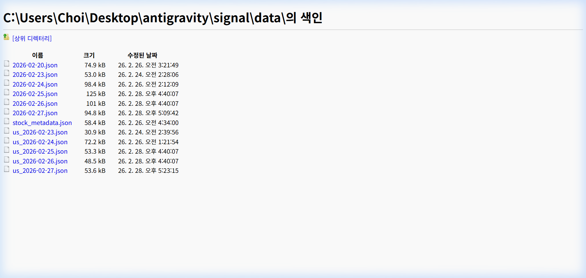

"코딩은 기세다."

**토스 증권 시그널 클론 코딩** 프로젝트의 데이터 수집 파이프라인이 궤도에 오르고 수천 건의 레코드가 누적되면서, 점차 그동안 간과했던 '데이터 품질' 문제가 가시화되었습니다. 복잡한 인프라 고민 없이 진행하는 '바이브 코딩' 그 7일차 기록입니다.

데이터 수집 파이프라인이 궤도에 오르고 수천 건의 레코드가 누적되면서, 점차 그동안 간과했던 '데이터 품질' 문제가 가시화되었습니다. 특히 주식 종목 정보를 관리하는 `stock_metadata.json` 파일에서 발견된 치명적 중복과 충돌 사례들은 AI 분석의 정확도를 저해하는 핵심 요인이었습니다. 오늘은 이러한 데이터 결함을 선별하고 체계적으로 정제하여 시스템의 무결성을 확보하는 과정을 다루었습니다.

## 데이터 오염의 발견: 중복과 키(Key) 충돌

문제는 크게 두 가지 유형으로 분류되었습니다. 첫째는 종목 명칭의 파편화입니다. 예를 들어 'HD한국조선해양'과 '한국조선해양'이 서로 다른 종목 코드를 가진 별개의 항목으로 존재하거나, '포스코인터내셔널'과 '포스코인터'처럼 이름이 모호하게 중축되어 있었습니다. 둘째는 더욱 심각한 형태인 '키(Key) 충돌'이었습니다. 특정 종목 코드(예: 000640)가 '하이트진로'와 '현대오토에버'라는 두 개의 서로 다른 회사 명칭에 동시에 매핑되어 있는 식입니다. 이러한 오류는 시그널 수집 시 잘못된 종목으로 뉴스를 요약하거나 연관 종목을 엉뚱하게 매칭하는 결과를 초래합니다.

## 정밀 진단: 종목 코드 기반의 무결성 검증

이러한 전수 검사를 수작업으로 진행하기에는 불가능한 규모이기에, 데이터 무결성을 검증하는 정교한 파이썬 스크립트를 작성했습니다. 종목 코드를 역방향으로 추적하여 하나의 코드에 여러 이름이 붙어 있는 케이스를 추출하고, 문자열 유사도 분석을 통해 명칭은 다르지만 실질적으로 같은 기업인 항목들을 선별했습니다.

```python
# 주식 메타데이터 중복 및 충돌 전수 검사 스크립트
import json
from collections import defaultdict

def validate_metadata(file_path):
    with open(file_path, "r", encoding="utf-8") as f:
        data = json.load(f)
    
    # 한국 주식 데이터 섹션 추출
    kr_data = data.get("KR", {})
    code_to_names = defaultdict(list)
    
    # 1. 종목코드 기반 충돌 탐지
    for symbol, info in kr_data.items():
        name = info.get("name", "")
        code_to_names[symbol].append(name)
    
    # 2. 결과 리포트 출력
    collision_count = 0
    for symbol, names in code_to_names.items():
        if len(set(names)) > 1:
            print(f"[충돌 발견] 코드: {symbol} | 매팅된 명칭들: {names}")
            collision_count += 1
            
    print(f"\n검사 완료. 총 {len(kr_data)}개 종목 중 {collision_count}건의 충돌 확인.")

validate_metadata("data/stock_metadata.json")
```

## 해결책: 메타데이터 표준화와 병합 로직

키 충돌 문제는 한국거래소(KRX)에서 제공하는 공식 종목 코드를 최우선 기준으로 삼아 데이터를 전면 재구축하는 방식으로 해결했습니다. 데이터 정제 과정에서 신뢰할 수 있는 단일 출처(Single Source of Truth)를 확보하는 것이 얼마나 중요한지 다시금 확인했습니다. 

또한 기존에 데이터 수집과 메타데이터 관리가 혼재되어 있던 로직을 분리했습니다. 메타데이터만을 전문적으로 동기화하는 `bootstrap_metadata.py`를 별도로 구축하여 시그널 수집 프로세스의 부하를 줄였습니다. 이제 종목 마스터 정보는 정해진 주기마다 별도의 검증 절차를 거쳐 업데이트되므로, 시그널 엔진은 데이터 충돌 걱정 없이 분석에만 집중할 수 있게 되었습니다.



위 이미지는 복잡하게 얽혀 있던 폴더 구조를 데이터, 소스 코드, 테스트 코드로 명확히 분리한 모습입니다. 체계적인 디렉토리 관리는 단순한 정리 정돈을 넘어 대규모 데이터 처리를 위한 논리적 설계의 시작입니다. 정제된 데이터를 바탕으로 한층 더 날카로워질 내일의 AI 분석 결과가 벌써부터 기다려집니다. 

내일은 이렇게 잘 정돈된 데이터를 사용자에게 가장 효과적으로 전달하기 위한 인터페이스 개선과 유려한 카드 디자인 구현 과정을 공유하겠습니다.

---

## 오늘의 개발 요약

목표: 종목 메타데이터 무결성 검증 및 데이터 정제 자동화 로직 구현
도구: Python, JSON Parsing, Data Validation Scripts

*태그: 데이터무결성, JSON, 주식메타데이터, 데이터정제, 파이썬, 개발일기*
