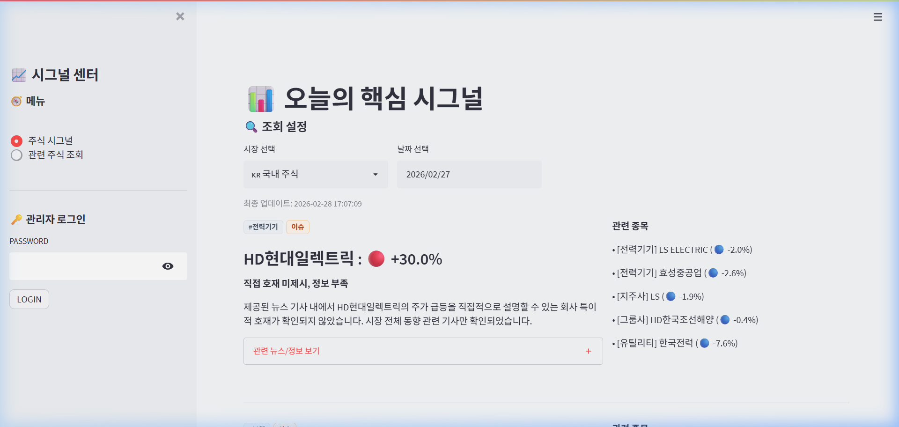

"코딩은 기세다."

**토스 증권 시그널 클론 코딩** 프로젝트의 데이터 수집 엔진과 요약 로직이 안정권에 진입함에 따라, 이제는 최종 사용자가 마주하게 될 인터페이스(UI)의 사용성을 극대화하는 단계에 도달했습니다. 복잡한 인프라 고민 없이 진행하는 '바이브 코딩' 그 8일차 기록입니다.

데이터 수집 엔진과 요약 로직이 안정권에 진입함에 따라, 이제는 최종 사용자가 마주하게 될 인터페이스(UI)의 사용성을 극대화하는 단계에 도달했습니다. 정보의 양이 충분하더라도 이를 전달하는 방식이 투박하다면 서비스의 본질적인 가치를 충분히 전달할 수 없습니다. 오늘은 Streamlit 프레임워크를 기반으로 간결하고 세련된 카드 디자인을 구현하는 데 집중했습니다.

## UI 디자인: Streamlit으로 구현하는 카드 레이아웃

Streamlit은 기본적으로 데이터 대시보드 제작에 최적화된 도구이기에 복잡한 커스텀 UI를 만드는 데는 제약이 따릅니다. 하지만 `st.markdown` 함수의 `unsafe_allow_html=True` 옵션을 전략적으로 활용하여 한계를 극복했습니다. 브라우저가 직접 해석할 수 있는 인라인 CSS와 HTML 태그를 삽입함으로써, Streamlit의 정형화된 위젯 틀에서 벗어나 둥근 모서리와 은은한 그림자가 적용된 카드 레이아웃을 완성했습니다. 

디자인의 핵심은 정보의 계층 구조입니다. 카드의 최상단에는 종목의 섹터를 의미하는 해시태그를 배치하고, 중앙에는 종목명과 주가 등락률을 굵은 폰트로 강조했습니다. 하단에는 Gemini가 요약한 정보를 배치하여 사용자의 시선이 위에서 아래로 물 흐르듯 이동하도록 구성했습니다. 흰색 배경에 옅은 회색 테두리를 적용하여 정보의 가독성을 높이는 한편, 전반적으로 여백의 미를 살려 사용자에게 편안한 읽기 경험을 제공하고자 노력했습니다.

## 사용자 경험: 자동 새로고침(Auto Refresh) 기능 구현

기술적인 편의성 또한 대폭 강화했습니다. 주식 시그널은 실시간성이 핵심인 만큼, 사용자가 브라우저의 새로고침 버튼을 누르지 않아도 데이터가 최신 상태를 유지해야 합니다. 이를 위해 5분 간격의 자동 새로고침(Auto Refresh) 기능을 구현했습니다.

## 반응형 웹: 모바일 사용자 경험(UX) 최적화

위 이미지는 고도화된 UI가 적용된 실제 서비스 화면입니다. 비록 Streamlit이 가진 제약 속에서 최대치의 심미성을 끌어냈으나, 더 정교한 애니메이션과 완벽한 SEO(검색 엔진 최적화)를 구현하기 위해서는 점진적으로 Next.js와 같은 전문 웹 프레임워크로의 전환이 필요함을 절감했습니다.

오늘의 UI 고도화 작업을 통해 서비스는 단순한 데이터 출력기를 넘어 하나의 완성된 프로덕트로서의 면모를 갖추게 되었습니다. 수치가 시각적 언어로 변환될 때 사용자는 비로소 정보에 몰입할 수 있다는 사실을 다시금 깨달았습니다. 내일은 다가오는 프로젝트 마무리 단계를 앞두고, 로컬 개발 환경에서 효율적으로 AI 쿼터(Quota)를 관리하고 모델 성능을 최적화하는 전략을 다룰 예정입니다.

---

## 오늘의 개발 요약

목표: 깔끔한 카드 UI 구현 및 모바일 대응, 자동 새로고침 기능 최적화
도구: Streamlit, Custom CSS, HTML Injection, Responsive Design Logic

*태그: Streamlit, UIDesign, 인터페이스, CSS, AutoRefresh, 개발일기*
